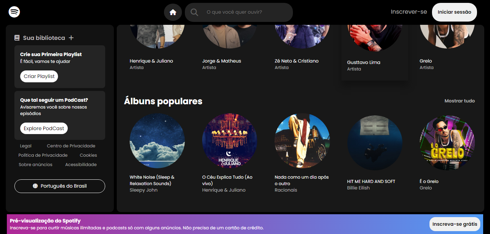

# Spotify - Player de Música 

**Um player de música simples inspirado no Spotify.**

## Descrição
Este projeto tem como objetivo criar um clone do website do spotify, permitindo aos usuários navegar por artistas e álbuns populares. Vale ressaltar que: é um projeto para fins de aprendizado, não quero copiar a idea da empresa Spotify. :smile: 

## Funcionalidades
* Navegação por artistas populares
* Navegação por álbuns populares

## Tecnologias Utilizadas
* HTML
* CSS
* JavaScript

## Como Contribuir :star:
Contribuições são bem-vindas! Para contribuir com este projeto, siga estes passos:
1. Fork este repositório
2. Crie um novo branch
3. Faça suas alterações
4. Crie um pull request

## Autores
* Luiz Marcolino - desenvolvedor front-end
